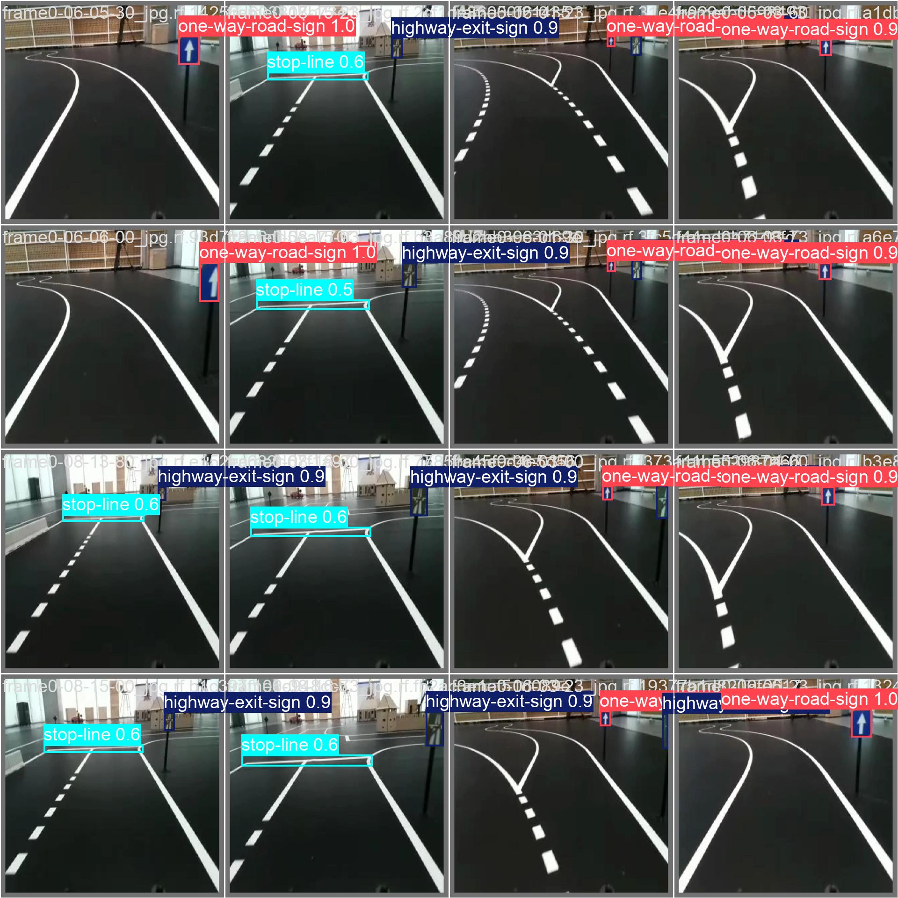
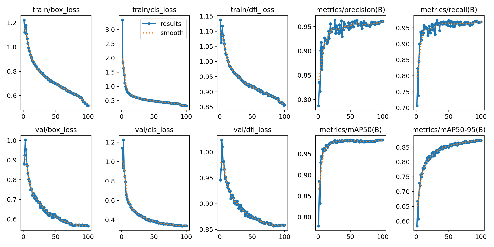
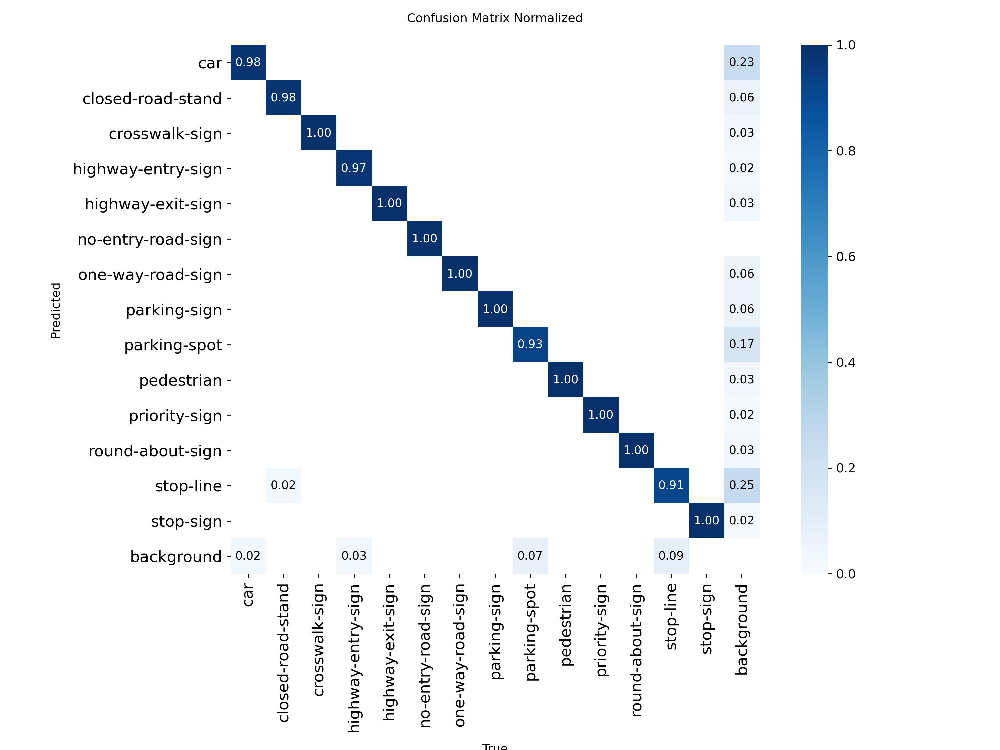

# Object Detection Training Pipeline

A flexible training and evaluation pipeline for object detection models. Supports any model from the Ultralytics [models](https://docs.ultralytics.com/models/).

**Example Use Case**: This repository includes configuration for a BFMC (Bosch Future Mobility Challenge) dataset to demonstrate usage.

> Developed at the [SenseLAB](http://senselab.tuc.gr/) of the [Technical University of Crete](https://www.tuc.gr/el/archi)

[](LICENSE)
[](https://www.python.org/downloads/)
[](https://pytorch.org/)
---

## Features

- **Multi-Model Support**: Train any Ultralytics model (YOLOvX,RT-DETR, YOLOE, etc.)
- **Comprehensive Evaluation**: Model comparison, per-class analysis, training history visualization
- **Export Ready**: Convert models to ONNX, TensorRT, TFLite for deployment

---

## Example Dataset

This repository is configured with the **BFMC Dataset v13** (Team DriverIES) as an example:

- **Source**: [BFMC Dataset on Roboflow](https://universe.roboflow.com/team-driverles/bfmc-6btkg/dataset/13)
- **License**: CC BY 4.0
- **Use Case**: Autonomous driving / smart city navigation
- **Classes**: 14 object classes (cars, pedestrians, traffic signs, etc.)

**You can replace this with your own dataset** by downloading your dataset and updating the filepaths in `training/configs/config.yaml`.

---

## Quick Start

1. **Prepare Your Dataset**: Organize in Ultralytics-compatible format (see Dataset section below)
2. **Configure**: Edit `training/configs/config.yaml` with the correct dataset filepaths
3. **Train**: `cd training && python3 scripts/train.py --model yolo8n --batch-size 16 --workers 16 --epochs 100`
4. **Evaluate**: `cd training && python3 scripts/evaluate_checkpoint.py --model_dir results/your_model/`
5. **Deploy**: Deploy on a source with `cd training && python3 scripts/inference.py --weights results/your_model/best.pt --export onnx`
6. **Export**: Export to ONNX/TensorRT with `cd training && python3 scripts/inference.py --weights results/your_model/best.pt --source video.mp4 --delay 50`

### Supported Models

See [Ultralytics Models](https://docs.ultralytics.com/models/)

### Example Detection Results



---

## Project Structure

```txt
bfmc_vision_simple/
├── training/                       # Model training logic
│   ├── scripts/                    # Core scripts
│   │   ├── train.py                # Training script
│   │   ├── evaluate.py             # Model comparison
│   │   ├── evaluate_checkpoint.py  # Single model verification
│   │   └── inference.py           # Inference & export
│   │   
│   ├── configs/
│   │   └── config.yaml          # Training configuration
│   ├── utils/                   # Helper utilities
│   └── models/
│       └── pretrained/          # Downloaded initial weights from ultralytics
│
├── results/                     # Training & Evaluation outputs
│   ├── yolov8n_2024.../         # Individual training run
│   │   ├── weights/             # Best/last checkpoints
│   │   └── train_eval/          # Auto-validation results
│   └── comp_eval_.../           # Comparison reports
│
├── dataset/                     # BFMC vision dataset
│   ├── train/                   # Training images
│   ├── valid/                   # Validation images
│   ├── test/                    # Test images
│   └── data.yaml                # Dataset configuration
│
└── assets/                      # Documentation assets
```

---

## Training

The `train.py` script handles model training, auto-downloading weights, and validating the best model.

**Capabilities:**

1. **Train Models**: Supports any Ultralytics model (YOLOv8, YOLOv11, RT-DETR, YOLO-World, etc.) in all size variants.
2. **Auto-Validation**: Automatically runs validation on the best model after training and saves to `train_eval/`.
3. **Auto-Download**: Fetches pretrained weights if not found locally.
4. **Path Management**: Automatically resolves dataset paths relative to the project structure.

### Train Specific Models

```bash
cd training

# Train individual models (specify exact model name)
python3 scripts/train.py --model yolov8n --batch-size 16 --workers 16 --epochs 100
python3 scripts/train.py --model yolo11s --batch-size 16 --workers 16 --epochs 100
python3 scripts/train.py --model rtdetr-l --batch-size 16 --workers 16 --epochs 100
```

### Train All Models

Train multiple models in sequence using the models defined in `training/configs/config.yaml`:

```bash
cd training

# Train all models specified in config.yaml under 'models' section
# This will train: yolov8n, yolo11n, and rtdetr-l (or whatever is configured)
python3 scripts/train.py --model all --batch-size 16 --workers 16 --epochs 100
```

> **Note**: The `--model all` option trains the models specified in the `models` section of `config.yaml`. Edit that section to change which models are trained when using `--model all`.

---

## Evaluation

### Validation vs. Test Metrics

It is important to distinguish between the metrics generated during training and those from the evaluation script:

- **Validation Set (`val`)**: Used by `train.py` during training.
  - The graphs saved in your training results folder (e.g., `results.png`, `confusion_matrix.png`, `BoxPR_curve.png`) reflect performance on the **Validation Set**.
  - These metrics are used to track progress and select the best model checkpoint.

- **Test Set (`test`)**: Used by `evaluate_checkpoint.py` (and `evaluate.py`).
  - The `evaluate_checkpoint.py` script explicitly runs evaluation on the **Test Set** (unseen data).
  - The outputs in the `post_eval/test` folder reflect the model's performance on this held-out dataset, providing the most accurate estimate of real-world performance.

### Single Model Verification

The `evaluate_checkpoint.py` script is designed for verifying a specific training run.

**Capabilities:**

1. **Verify Training**: Validates a specific checkpoint on both Test and Val splits.
2. **Plot History**: Generates Loss and mAP curves from `results.csv` (Train vs Val).
3. **Auto-Config**: Automatically finds dataset and parameters from `args.yaml` inside the model folder.

```bash
cd training

# Verify a specific training run
python3 scripts/evaluate_checkpoint.py --model_dir results/yolov8_*
```

### Compare Models

The `evaluate.py` script compares multiple models side-by-side.

**Capabilities:**

1. **Compare Models**: Evaluates multiple models side-by-side on the Test set.
2. **Generate Reports**: Creates markdown reports, bar charts, and heatmaps (mAP50, mAP50-95).
3. **Robust Resolution**: Automatically detects the correct dataset from `args.yaml` for each model.
4. **Pretrained Comparison**: Can include baseline pretrained models in the comparison.

```bash
cd training

# Compare all trained models
python3 scripts/evaluate.py

# Include pretrained baselines to see improvement
python3 scripts/evaluate.py --include-pretrained

# Evaluate specific weights
python3 scripts/evaluate.py --weights results/yolov8_*/weights/best.pt results/yolov11_*/weights/best.pt
```

### Generated Outputs

- `results/model_comparison.csv` - Complete metrics table
- `results/comparison_report.md` - Detailed report with ratings
- `results/per_class_ap50_comparison.png` - AP50 bar chart
- `results/per_class_ap50_heatmap.png` - AP50 heatmap
- `results/per_class_ap50-95_comparison.png` - AP50-95 bar chart
- `results/per_class_ap50-95_heatmap.png` - AP50-95 heatmap

### Understanding the Outputs (Plots & Metrics)

The training and evaluation scripts generate several key plots:

**Training Plots (`results/`):**

- **`results.png`**: Summary of Loss, Precision, Recall, and mAP over epochs.
- **`confusion_matrix.png`**: Shows which classes are being confused with others. Diagonal is good.
- **`BoxPR_curve.png`**: Precision-Recall curve. Top-right is better.
- **`F1_curve.png`**: F1 score vs Confidence. Peak F1 shows the optimal confidence threshold.

**Evaluation Plots (`post_eval/history_plots/`):**

- **`loss_curves.png`**: **Train vs. Validation Loss**.
  - If Train Loss keeps dropping but Val Loss goes up -> **Overfitting**.
  - If both stay high -> **Underfitting**.
- **`metrics_curves.png`**: mAP50 and mAP50-95 over epochs.

**Comparison Plots (`results/comp_eval_.../`):**

- **`per_class_ap50_comparison.png`**: Bar chart showing which model is best for *each specific class*.
- **`per_class_ap50_heatmap.png`**: Visual heatmap of performance. Darker/Redder usually means higher accuracy depending on the colormap.

### Qualitative Ratings

Models receive automatic quality ratings:

- **Excellent** (mAP50-95 ≥0.70): Production-ready
- **Very Good** (≥0.60): High-quality detection
- **Good** (≥0.50): Acceptable performance
- **Fair** (≥0.40): Baseline performance
- **Needs Improvement** (<0.40): Requires more training

Example output:

```txt
Training complete for YOLOv8 (yolov8n)
  mAP50:    0.850 - Excellent
  mAP50-95: 0.620 - Very Good
```

---

## Inference

The `inference.py` script allows you to detect objects in various inputs and export models for deployment.

**Capabilities:**

1. **Run Inference**: Detect objects in images, videos, or a live camera stream.
2. **Export Models**: Convert `.pt` models to ONNX, TensorRT, or TFLite for devices like Raspberry Pi.
3. **Visualize**: Display results with bounding boxes or save them to disk.
4. **Control Speed**: Adjust playback speed for video inspection (`--delay`).

### Run on Images/Videossources

```bash
cd training

# Default Uses the test set from config file: config['dataset']['test'] + /images
python3 scripts/inference.py --weights results/yolov8_*/weights/best.pt

# Use a specific source
python3 scripts/inference.py --weights results/yolov8_*/weights/best.pt --source /path/to/images/

# Run on live camera
python3 scripts/inference.py --weights results/yolov8_*/weights/best.pt --camera 0

# Run on video
python3 scripts/inference.py --weights results/yolov8_*/weights/best.pt --source video.mp4 --save

# Run on video with delay (slow down playback)
python3 scripts/inference.py --weights results/yolov8_*/weights/best.pt --source video.mp4 --delay 50
```

---

## Model Export

### Export to ONNX (Raspberry Pi)

```bash
cd training

# Export to ONNX
python3 scripts/inference.py --weights results/yolov8_*/weights/best.pt --export onnx

# Export to TensorRT
python3 scripts/inference.py --weights results/yolov8_*/weights/best.pt --export engine

# Export to TFLite
python3 scripts/inference.py --weights results/yolov8_*/weights/best.pt --export tflite
```

---

## Dataset

### Using Your Own Dataset

This pipeline works with any dataset in Ultralytics-supported formats (YOLO, COCO, etc.).

**Required Structure:**

```
your_dataset/
├── train/           # Training images and labels
├── valid/           # Validation images and labels  
├── test/            # Test images and labels (optional)
└── data.yaml        # Dataset configuration file
```

**Configuration (`data.yaml`):**

```yaml
path: /path/to/your_dataset
train: train
val: valid
test: test  # optional

# Class names are defined in your dataset's data.yaml
# They are automatically embedded in the trained model weights
```

Update `training/configs/config.yaml` to point to your `data.yaml` file.

### Example: BFMC Dataset

The repository includes the BFMC dataset as a reference:

- **Total Images**: 8,509
- **Classes**: 14
- **Format**: YOLO

### Class Distribution

| Class | Count | Class | Count |
|-------|-------|-------|-------|
| car | 2,450 | stop-sign | 156 |
| pedestrian | 892 | priority-sign | 289 |
| parking-spot | 1,234 | crosswalk-sign | 445 |
| stop-line | 678 | highway-entry-sign | 123 |

**Split**:

- Training: 7,752 images (91%)
- Validation: 437 images (5%)
- Test: 320 images (4%)

---

## Utilities

### Dataset Analysis

Analyze and validate your dataset:

```python
from utils.data import analyze_dataset, get_class_distribution, validate_labels

# Get dataset statistics
stats = analyze_dataset("../dataset/data.yaml")
print(f"Total images: {stats['total_images']}")
print(f"Classes: {stats['num_classes']}")

# Check class distribution
dist = get_class_distribution("../dataset/data.yaml", split='train')
for cls, count in dist.items():
    print(f"{cls}: {count}")

# Validate labels for issues
results = validate_labels("../dataset/data.yaml")
print(f"Valid: {results['valid_labels']}/{results['total_labels']}")
```

Command-line usage:

```bash
cd training
python3 utils/data.py --data ../dataset/data.yaml --validate --quality
```

### Visualization

Plot training results and model comparisons:

```python
from utils.visualize import plot_training_curves, plot_class_distribution, plot_model_comparison

# Plot training curves from results
plot_training_curves("results/yolov8_best", output_path="curves.png")

# Visualize class distribution
from utils.data import get_class_distribution
dist = get_class_distribution("../dataset/data.yaml")
plot_class_distribution(dist, output_path="distribution.png")

# Compare models (after evaluation)
import pandas as pd
df = pd.read_csv("results/model_comparison.csv")
plot_model_comparison(df, output_path="comparison.png")
```

---

## Configuration

Edit `training/configs/config.yaml` to adjust:

- **Training parameters**: epochs, batch size, image size
- **Model selection**: model variants (n/s/m/l/x)
- **Augmentation**: data augmentation settings
- **Inference**: confidence/IoU thresholds

### RTX 4090 Optimized Settings

The default configuration is optimized for RTX 4090:

- `batch_size: 16` - Can increase to 32 for smaller models
- `imgsz: 640` - Standard YOLO resolution
- `amp: true` - Mixed precision for faster training
- `cache: true` - Cache images in RAM

---

## Training Visualizations






---

## Performance Benchmarks

### Expected Results on BFMC Dataset

| Model | mAP50 | mAP50-95 | FPS (4090) | Size |
|-------|-------|----------|------------|------|
| YOLOv8n | ~0.85 | ~0.60 | ~800 | 6 MB |
| YOLOv11n | ~0.87 | ~0.63 | ~750 | 5 MB |
| RT-DETR-l | ~0.89 | ~0.68 | ~150 | 65 MB |

### Inference Speed (640x640 input)

| Hardware | YOLOv8n | YOLOv11n | RT-DETR-l |
|----------|---------|----------|-----------|
| RTX 4090 | 800 FPS | 750 FPS | 150 FPS |
| RTX 3090 | 600 FPS | 550 FPS | 120 FPS |
| RTX 3060 | 400 FPS | 380 FPS | 80 FPS |
| Jetson Xavier | 120 FPS | 110 FPS | 25 FPS |
| Raspberry Pi 4 | 15 FPS | 14 FPS | 3 FPS |

---

## Hardware Requirements

### For Training

**Minimum**:

- CPU: 4+ cores
- RAM: 16 GB
- GPU: NVIDIA GPU with 8GB VRAM
- Storage: 10 GB

**Recommended**:

- CPU: 8+ cores
- RAM: 32 GB
- GPU: RTX 3090/4090 (24GB VRAM)
- Storage: 50 GB (SSD)

## Troubleshooting

### CUDA Out of Memory

- Reduce batch size in `training/configs/config.yaml`
- Use smaller model variant (nano instead of small)
- Disable cache: `cache: false`

### Slow Training

- Enable `cache: true` in config
- Ensure `amp: true` is set
- Check GPU utilization with `nvidia-smi`

### Poor Accuracy

- Increase epochs (try 150-200)
- Try larger model variant
- Adjust augmentation settings
- Verify dataset quality with `check_split_quality.py`

---

## License

This project is licensed under the MIT License - see the [LICENSE](LICENSE) file for details.

---

## Acknowledgments

- **Ultralytics** - YOLO implementation
- **Roboflow** - Dataset hosting and tools
- **BFMC Team** - Competition organization
- **Team DriverIES** - Dataset example

---

## AI-Assisted Development

**LLM Usage**: This project was developed with assistance from Claude (Anthropic). While efforts have been made to ensure code quality and correctness:

- **Use with Caution**: Review and test all code thoroughly before deployment
- **No Warranty**: Code is provided "as-is" without guarantees
- **Verify Results**: Always validate model performance and system behavior
- **Safety Critical**: Extra caution required for autonomous driving applications

---
